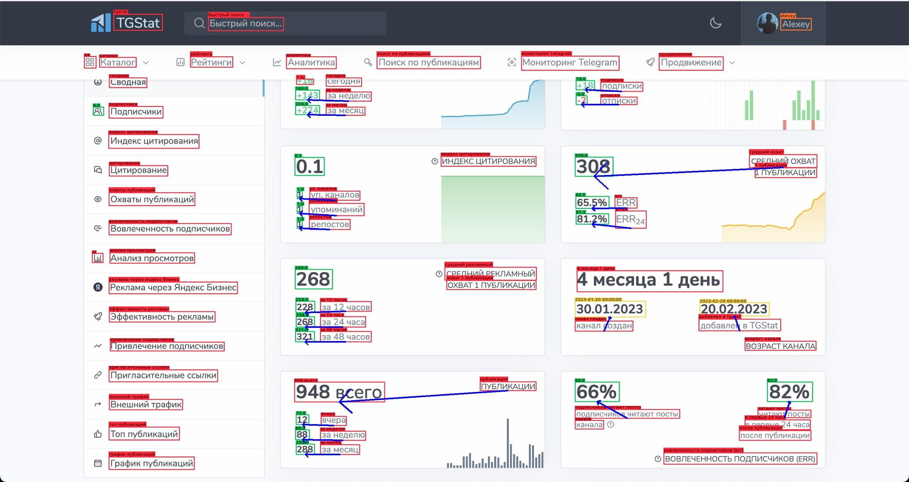

# TopBlog-Hack-2023


## Краткое описание решения:
Для решения задачи сбора статистики медиа-сервиса по скриншоту был использован комбинированный подход: 
 - На первом шаге производится детекция текста и чисел; 
 - Далее происходит распознавание текста и чисел среди детекций; 
 - Последним этапом является сопоставление необходимых параметров с их числовым значением. 
## Технические особенности:
Python, PyTorch, Streamlit, easyocr, CRAFT, SVTR
## Уникальность:
Уникальность решения заключается в извлечении всех текстовых и численных значений из изображения.
## Запуск:
```
streamlit run Demo.py
```
